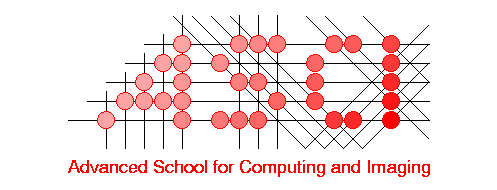
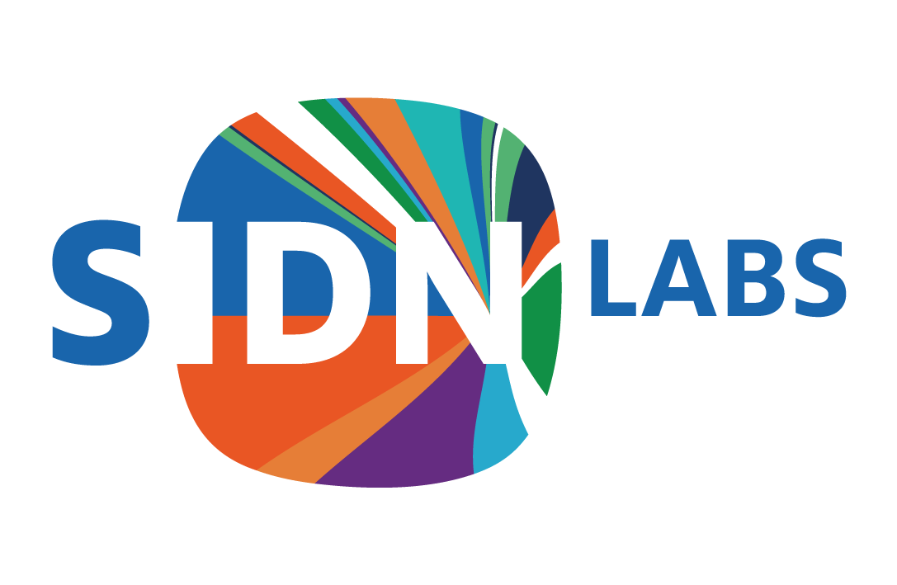
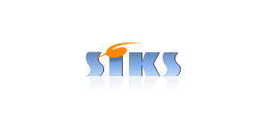

<!--  -->

<!-- **Did you attend Alice & Eve 2024? Please fill out our feedback form: [https://forms.gle/cFKzTXHZQpLtyMY17](https://forms.gle/cFKzTXHZQpLtyMY17)**-->

Welcome to our free one-day workshop for celebrating women studying and working in computing!
Alice & Eve aims to bring together talents in the field of computing. The sixth edition of this workshop will be hosted on **31 October 2025** by the University of Groningen.

Alice and Eve event is inspired by the [BCS Lovelace Colloquium](https://bcswomenlovelace.bcs.org/) that started in 2008. For more details about earlier editions of Alice & Eve, see the websites of [2020](https://fmt.ewi.utwente.nl/events/aliceandeve2020/), [2021](https://aliceandeve.cs.ru.nl/), [2022](https://alice-and-eve.github.io/2022/), [2023](https://alice-and-eve.github.io/2023/) and [2024](https://alice-and-eve.github.io/2024/).

The event is held during a single day, and features:

- keynote talks,
- a poster contest, and
- an exhibition on women in computing.

Join us, and participate to our poster contest on the topic of your choice!

### Date:

Alice & Eve will take place on October 31, 2025.

### Venue:

The workshop will be held in BernoulliBorg on the first floor, Groningen.
<iframe src="https://www.google.com/maps/embed?pb=!1m18!1m12!1m3!1d2387.7542325441527!2d6.533710611983161!3d53.240181772142954!2m3!1f0!2f0!3f0!3m2!1i1024!2i768!4f13.1!3m3!1m2!1s0x47c9cd1a4f77456b%3A0x9841c274f3f056e5!2sBernoulliborg!5e0!3m2!1sen!2snl!4v1734345275425!5m2!1sen!2snl" width="600" height="450" style="border:0;" allowfullscreen="" loading="lazy" referrerpolicy="no-referrer-when-downgrade"></iframe> 

<!-- <iframe src="[https://www.google.com/maps/embed?pb=!1m18!1m12!1m3!1d4894.777675507259!2d4.489776676910258!3d52.16362346255315!2m3!1f0!2f0!3f0!3m2!1i1024!2i768!4f13.1!3m3!1m2!1s0x47c5c6935ca128d3%3A0x8979448a419f89c4!2sPLNT%20Leiden!5e0!3m2!1sen!2snl!4v1727699287973!5m2!1sen!2snl]" width="600" height="450" style="border:0;" allowfullscreen="" loading="lazy" referrerpolicy="no-referrer-when-downgrade"></iframe> -->

<!-- <iframe src="https://www.google.com/maps/embed?pb=!1m18!1m12!1m3!1d2447.751991104805!2d4.482933476457672!3d52.15701986304036!2m3!1f0!2f0!3f0!3m2!1i1024!2i768!4f13.1!3m3!1m2!1s0x47c5c6f2447daae3%3A0x48e9dc4f075bb167!2z6I6x6aG_5aSn5a2m!5e0!3m2!1szh-CN!2snl!4v1710771504599!5m2!1snl!2snl" width="600" height="450" style="border:0;" allowfullscreen="" loading="lazy" referrerpolicy="no-referrer-when-downgrade"></iframe> -->

### Registration:

The registration is free and includes coffee breaks, lunch and drinks. We welcome everyone of **all genders**, **from bachelor students to full professors**, to attend the event.

<!--REGISTRATION IS CLOSED!-->

[SIGN UP HERE](https://forms.gle/7ULkZzgR1zj3w7HG8)

## Program

To be announced!
<!--
| Time |  |
|---|---|
| 09:30 - 10:00  | Welcome coffee (The Launch)|
| 10:00 - 10:10  | Opening (The Launch)|
| 10:10 - 10:40  | Talk: **Suzan Verberne** (Leiden University) - **The role of truth in Large Language Models** In this presentation I will discuss issues of misinformation and bias in Large Language Models. I will introduce where these problems come from, how we can measure them, and what their implications are. I will follow-up with recommendations for responsible research with LLMs and the importance of keeping the human in the loop. |
| 10:40 - 11:10  | Talk: **Niki van Stein** (Leiden University)- **Explainable Artificial Intelligence, Identifying the Dimensions that Matter** In an era where artificial intelligence (AI) plays an increasingly critical role in decision-making, Explainable AI (XAI) emerges as a powerful tool to ensure transparency and accountability. This talk will explore the importance of explainability in AI, particularly in domains where models are often viewed as "black boxes." Through the lens of my own experiences, I will emphasize how each of us, with our unique genetic and experiential makeup, contributes to a diverse landscape in which we should search for dimensions that matter instead of dimensions that differentiate, both in AI and real life. Drawing on real-world applications in fields like predictive maintenance and plant breeding, I will introduce the key challenges facing XAI today: how to meaningfully benchmark explainability methods, address bias, and handle complex non-linear interactions in time-series data. I will also highlight the role of global sensitivity analysis in explaining deep neural networks with large feature sets, and the novel use of evolutionary computation for multi-objective counterfactuals in time-series classification. Ultimately, the talk will underscore the value of using XAI to help AI "teach us," fostering deeper insights into both technology and ourselves. |
| 11:10 - 11:30  | Coffee Break |
| 11:30 - 12:00  | Talk: **Antonia Affinito** (University of Twente) - **Growing Up Digital: Risks in Mobile Application Usage**  In today’s digital era, digital natives - individuals who have grown up using digital technology from a very young age - frequently use online platforms for education, entertainment, and social interaction. While these platforms offer many benefits, they also pose risks, such as exposure to inappropriate content, online scams, and identity theft. Children and adolescents, despite their comfort with technology, are particularly vulnerable because they are often unaware of the potential risks. Furthermore, the applications they use daily collect and access a wide range of personal information. While recent regulatory frameworks like COPPA, CCPA, and GDPR establish clear rules for data acquisition and privacy for specific age groups, their practical application remains uncertain. This talk presents the main risks the children face online and how data application practices align with privacy policies among mobile applications targeting different age groups. |
| 12:00 - 12:30  | Talk: **Gabriele Keller** (University of Utrecht) - **A pragmatic approach to verified compilation** |
| 12:30 - 14:00  | Lunch & Exhibition |
| 14:00 - 14:30  | Sponsor Lightning Talks (The Launch)  Talk from **DuckDB** - **ART in Industry** - **Tania Bogatsch** Indexing is fundamental in relational databases, and academia provides much research. In 2013, Leis et al. published 'The adaptive radix tree: ARTful indexing for main-memory databases.' Based on this research, DuckDB, a high-performance relational database system, chose ART as its primary index structure. This talk presents the main concepts of ART and dives into the benefits and challenges of implementing an academic solution in a real-world system. Talk from **SIDN Labs** - **Characterizing Phishing Attacks at ccTLD Scale** - **Giovane Moura** Phishing remains a prime cyber threat. We provide a 10-year longitudinal analysis of phishing attacks from three ccTLD registries: .nl, .ie, and .be, covering over 8 million active domains. Our study includes data from 28,000+ phishing domains. We identify two main attack strategies: national companies are often impersonated via malicious domains registered under their own ccTLDs, enhancing mimicry. International companies are impersonated using compromised domains, lowering mimicry but avoiding registration costs.  Our findings show that 80% of phishing attacks in the examined ccTLDs use compromised domain names.|
| 14:30 - 15:00  | Talk: **Katja Tuma** (Vrije University Amsterdam) - **Gender in Security Decision Making: Research and Impact**  Now, more than ever, we must investigate how software security decisions are made. The demand for security expertise is rising, and there is a global shortage in the security workforce. More specifically, a significant gender gap exists in the field of security and privacy. But does gender play a role when technical security decisions are made? What gender biases exist in our communities, and how can we begin to break these stereotypes? In this talk, I will guide you through our recent scientific discoveries and diversity and inclusion efforts, aiming to inspire change among computer science students in the Netherlands. |
| 15:00 - 15:30  | Coffee Break |
| 15:30 - 16:00  | Talk: **Anna Wilbik** (University of Maastricht) - **Federated learning – a hype or a trend?** |
| 16:00 - 16:15  | Poster Awards |
| 16:15 - 17:00  | Panel: **Ethics in Computing: How can we design algorithms that are more fair, transparent and explainable?** Speakers: [Francien Dechesne](https://www.universiteitleiden.nl/en/staffmembers/francien-dechesne#tab-1) (Leiden University), Christine Utz (Radboud University), Hugo Jonker (Open University) |
| 17:00 - 18:00  | Goodbye Drinks |
-->

## Poster Contest

We invite all female students (Bachelor/Master/PhD) and early career researchers of computing and related subjects (in the broadest sense) to submit a poster. The poster could be on any computing topic they like: from social networking to quantum computing and from medical image processing to formal verification. 

<!--Thirty-two posters were short listed for display during the event. This year, we have two best posters:

**Ailsa Robertson**: Your Cryptography Will Be Broken – Act Now!

**Krist Shingjergji**: Sense the classroom: AI-supported synchronous online education for a resilient new normal

Congratulations!
-->

## Exhibition

In addition to the keynote talks and the posters, there will be an [exhibition](https://www.aliceandeve.nl/home) which portrays thirty women in computing and their most important contributions.

Some highlights of the exhibition:

- [Ada Lovelace](https://www.aliceandeve.nl/exhibition/ada-lovelace) who is known for her work on the sign of the ‘Analytics Machine’, the first ever general-purpose computer, and the first published algorithm;
- [Grace Hopper](https://www.aliceandeve.nl/exhibition/grace-hopper) who created the world’s first workable compiler and the Grace Hopper Celebration of Women in Computing, an annual conference;
- [The Bletchley Park Codebreakers](https://www.aliceandeve.nl/exhibition/the-bletchley-park-codebreakers-) included approximately 8,000 women, known as the "Bletchleyettes," whose crucial code-breaking efforts during World War II, including operating cryptographic machinery and breaking complex codes, remain largely unrecognized due to the enduring secrecy of their work.

More information can be found at the [exhibition booklet](https://fmt.ewi.utwente.nl/events/aliceandeve2020/booklet-13-01-2020.pdf).

Fantastic **[coding games](https://www.aliceandeve.nl/games)** and **[media](https://www.aliceandeve.nl/gallery)** - which include videos and podcasts related to women in computing - are also offered.

## Speakers

To be announced!

<!--
We have invited some inspiring women working on the cutting edge of computing. Confirmed speakers include:
  
- **[Suzan Verberne](https://liacs.leidenuniv.nl/~verbernes/)**, Professor at U Leiden
  
  I am a researcher in Natural Language Processing (NLP) and Information Retrieval (IR). My research focus is text mining and information retrieval in specific domains. I am a Full Professor at the Leiden Institute of Advanced Computer Science (LIACS). I am group leader of Text Mining and Retrieval Leiden.
  My vision is that domain-specific challenges can enable breakthroughs in computer science; more specifically in my fields NLP and IR. I currently supervise projects that develop and evaluate NLP and retrieval methods in a diversity of domains. I am work package leader for two H2020 projects and project co-leader of an NWA project.
  My group works on novel methods for representation learning, ranking, and information extraction. We work with a large diversity of textual data: archaeological reports, patents, scientific and legal publications, health records, newspaper texts, user-generated content in online patient communities (discussion forums), and posts on social media.

- **[Niki van Stein](https://www.nikivanstein.nl/)**, Assistant professor U Leiden
  
  Dr. Niki van Stein is a researcher, heading the XAI group, which is part of the Natural Computing Cluster of LIACS, and manager of the applied data science lab. She received her PhD in Computer Science from Leiden University in 2018. Niki’s research interest are in eXplainable AI for automated machine learning, global (Bayesian) optimization and neural architecture search. She mostly works on research with direct applications in industry, such as predictive maintenance, car and ship design optimization and schedule optimization.

- **[Antonia Affinito](https://people.utwente.nl/a.affinito)**, Assistant Professor at U Twente
  
  I am an Assistant Professor at the Design and Analysis of Communication Systems (DACS) group at the University of Twente. My research interests lie in the fields of Internet measurements and cyber threats detection. In 2023, I defended my thesis “Malicious and Large-Scale Phenomena over the Internet: An Analysis based on DNS” at the University of Napoli "Federico II" in Italy.

- **[Gabriele Keller](https://www.uu.nl/staff/GKKeller)**, Professor at U Utrecht
  
  My main research interests are functional programming, type systems, high-performance computing, and programming language based approaches to verification. I'm also interested in teaching of functional programming, and have co-authored the (still incomplete) Learning Haskell Tutorial together with Manuel Chakravarty.

- **[Katja Tuma](https://katjatuma.github.io/)**, Assistant professor at VU Amsterdam
  
  In 2021 I joined the Foundational and Experimental Security research group as Assistant Professor (Universitair docent 2) and am working at the Department of Computer Science at Vrije Universiteit Amsterdam within the Computer Systems group. I hold a Ph.D. in Computer Science and Engineering, which I completed at the University of Gothenburg. I am an active member of EUGAIN (WG3: From Ph.D. to Professor), and diversity co-officer for CSE department at the VU.

- **[Anna Wilbik](https://www.maastrichtuniversity.nl/m-wilbik)**, Professor at U Maastricht
  
  I am a researcher who aims at bridging the gap between the meaning of data and human understanding in complex application environments, where data can be of various natures. I am also an academic teacher and mentor, who believes that students learn most, when they are given responsibility and freedom in their learning process. I believe in an international orientation in research and teaching and a balance between academic, curiosity-driven research and industrial, problem-oriented research.

-->

## Jobs Board

During the conference, there will be the possibility for attendees to advertise open positions in their university/company. Furthermore, participants looking for jobs are also welcome to post their credentials and type of job/internship they are looking for. Job postings are under the following rules:
- Maximum one A4 flyer per company
- Maximum one A4 sheet per participant looking for jobs
- Each flyer must contain contact information
- Jobs must be pertinent to computing

## Organizing Committee

- [Dimka Karastoyanova](https://www.rug.nl/staff/d.karastoyanova/), University of Groningen
- [Kerstin Bunte](https://www.rug.nl/staff/k.bunte/), University of Groningen
- [Raffaella Carloni](https://www.rug.nl/staff/r.carloni/), University of Groningen
- [Ayushi Rastogi](https://www.rug.nl/staff/a.rastogi/), University of Groningen
- [Jiapan Guo](https://www.rug.nl/staff/j.guo/), University of Groningen

## Steering committee

- [Marieke Huisman](https://people.utwente.nl/m.huisman), Universiteit Twente (UT)
- [Sophie Lathouwers](https://wwwhome.ewi.utwente.nl/~lathouwerssam/), Universiteit Twente (UT)
- [Cynthia Liem](https://www.cynthialiem.com/), Technische Universiteit Delft (TUD)
- [Alma Schaafstal](https://people.utwente.nl/a.m.schaafstal), Universiteit Twente (UT)
- [Alexander Serebrenik](https://www.win.tue.nl/~aserebre/), Technische Universiteit Eindhoven (TU/e)
- [Mariëlle Stoelinga](https://wwwhome.ewi.utwente.nl/~marielle/), Universiteit Twente (UT)

## Code of Conduct
Alice and Eve is dedicated to providing a harassment-free conference experience for everyone, regardless of gender, gender identity and expression, sexual orientation, disability, physical appearance, body size, race, age or religion. We do not tolerate harassment of conference participants in any form. Conference participants violating these rules may be sanctioned or expelled from the conference at the discretion of the conference organizers.
Harassment includes, but is not limited to:
- Verbal comments that reinforce social structures of domination related to gender, gender identity and expression, sexual orientation, disability, physical appearance, body size, race, age, religion.
- Sexual images in public spaces
- Deliberate intimidation, stalking, or following
- Harassing photography or recording
- Sustained disruption of talks or other events
- Inappropriate physical contact
- Unwelcome sexual attention
- Advocating for, or encouraging, any of the above behaviour
  
Participants asked to stop any harassing behavior are expected to comply immediately. If someone makes you or anyone else feel unsafe or unwelcome, please report it as soon as possible by contacting us ether in person or via email.
<!--
Ilaria Battiston (either in person or via [email](mailto:Ilaria Battiston <ilaria@cwi.nl>)) or Iris Groen (either in person or via [email](mailto:Iris Groen <i.i.a.groen@uva.nl>)).
-->
This Code of Conduct was adapted from the [Geek Feminism Wiki anti-harassment policy](https://geekfeminism.fandom.com/wiki/Conference_anti-harassment/Policy).

## Our Sponsors

We are currently looking for sponsors. Contact [Raffaella Carloni](mailto:Raffaella Carloni <[r.carloni@rug.nl](https://www.rug.nl/staff/r.carloni/)>?subject=[Alice and Eve 2025] Sponsoring) for more information and a discussion on how your organization could support the 6th Alice and Eve workshop.

<!--

  

    

      
    

    

      
    

    

      
    

 

  

    

      
    

    

      
    

    

      
    

 

  

    

      
    

 

-->

<!--

  

    

      
    

    

      
    

    

      
    

 

  

    

      
    

    

      
    

  

-->
## Hosted by

  

    <!--

      
    
-->
    

      
    

    <!--

      
    
-->
  

## Contact Us

For questions regarding the workshop, please [contact the organizers](mailto:Dimka Karastoyanova <d.karastoyanova@rug.nl>, Kerstin Bunte <k.bunte@rug.nl>, Raffaella Carloni <r.carloni@rug.nl>, Ayushi Rastogi <a.rastogi@rug.nl>, Jiapan Guo <j.guo@rug.nl>?subject=[Alice and Eve 2025] Question)!

## About Groningen

To be added

